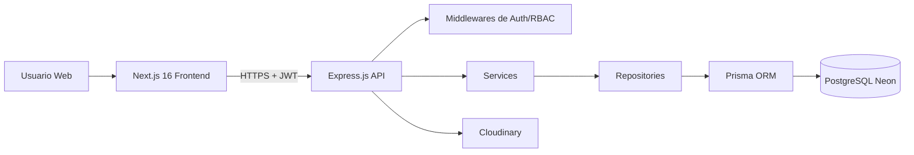

# GymFlow

**GymFlow** es una plataforma web SaaS para la gestion integral de gimnasios. El producto centraliza usuarios, membresias, reservas, entrenadores, nutricionistas, tienda virtual, pagos simulados, dashboard administrativo y reportes operativos.

El objetivo de este repositorio es presentar un proyecto profesional de portafolio en modo **documentation-first**. Aqui se define el analisis, la arquitectura, el modelo de datos, la API, los flujos principales, el plan de pruebas y la guia de despliegue antes de construir el codigo de la aplicacion.

## Stack Tecnologico

| Capa | Tecnologia |
| --- | --- |
| Frontend | Next.js 16, TypeScript, TailwindCSS, shadcn/ui, React Hook Form, Zod, Axios, TanStack Query, Chart.js, Lucide Icons |
| Backend | Express.js, TypeScript, Prisma ORM, JWT, bcrypt, Express Validator, Multer, Cloudinary, Helmet, CORS, Morgan, Cookie Parser |
| Base de datos | PostgreSQL en Neon |
| Despliegue | Vercel para frontend, Render para backend, Neon para base de datos, Cloudinary para imagenes |
| Documentacion API | OpenAPI 3.1 |
| Pruebas API | Bruno |

## Modulos Principales

- Autenticacion, usuarios, roles y permisos.
- Membresias, beneficios, renovaciones y validaciones de acceso.
- Salas, horarios, aforos y reservas.
- Entrenadores, nutricionistas, agendas y citas.
- Tienda virtual, carrito, ordenes, inventario y promociones.
- Pagos simulados y comprobantes internos.
- Dashboard administrativo, metricas, ventas, reservas y reportes.
- Auditoria de operaciones relevantes.

## Roles

- **Administrador:** controla configuracion, catalogos, usuarios, reportes y seguridad.
- **Recepcionista:** valida membresias, registra asistencias, gestiona reservas y pagos presenciales simulados.
- **Cliente:** compra membresias, reserva servicios, compra productos y consulta historial.
- **Entrenador:** gestiona agenda, sesiones y progreso del cliente.
- **Nutricionista:** gestiona agenda, consultas, planes nutricionales y observaciones.

## Arquitectura Resumida

## Documentacion

| Documento | Descripcion |
| --- | --- |
| [Analisis del problema](docs/01-analisis-del-problema.md) | Contexto, objetivos, alcance y justificacion. |
| [Requisitos](docs/02-requisitos.md) | Requisitos funcionales, no funcionales, restricciones y supuestos. |
| [Reglas de negocio](docs/03-reglas-de-negocio.md) | Politicas operativas del gimnasio y del sistema. |
| [Historias de usuario](docs/04-historias-de-usuario.md) | Backlog funcional desde la perspectiva de los actores. |
| [Casos de uso](docs/05-casos-de-uso.md) | Flujos principales, alternativos, precondiciones y postcondiciones. |
| [Modelo de dominio](docs/06-modelo-de-dominio.md) | Entidades, relaciones y responsabilidades. |
| [Modelo ER](docs/07-modelo-entidad-relacion.md) | Diagrama y tablas para PostgreSQL. |
| [Diccionario de datos](docs/08-diccionario-de-datos.md) | Campos, tipos, obligatoriedad y descripcion. |
| [Arquitectura](docs/09-arquitectura.md) | Arquitectura fisica, logica, por capas y flujos. |
| [Backend](docs/10-backend.md) | Estructura propuesta para Express, SOLID y responsabilidades. |
| [Frontend](docs/11-frontend.md) | Estructura propuesta para Next.js App Router. |
| [API REST](docs/12-api-rest.md) | Convenciones, endpoints, respuestas y autorizacion. |
| [Seguridad](docs/13-seguridad.md) | JWT, refresh token, roles, permisos y hardening. |
| [Dashboard](docs/14-dashboard.md) | KPIs, graficos e indicadores administrativos. |
| [UI/UX](docs/15-ui-ux.md) | Pantallas, componentes y acciones por vista. |
| [Roadmap](docs/16-roadmap.md) | Roadmap real de implementacion con fases, sprints, entregables, DoD, ruta critica y riesgos. |
| [Seed](docs/17-plan-base-datos-seed.md) | Datos iniciales planificados. |
| [Plan de pruebas](docs/18-plan-pruebas.md) | Estrategia funcional, API, integracion e interfaz. |
| [Instalacion y despliegue](docs/19-guia-instalacion-despliegue.md) | Guia futura para local, Neon, Cloudinary, Vercel y Render. |
| [SEO, accesibilidad y optimizacion](docs/20-seo-accesibilidad-optimizacion.md) | Estrategia SEO, metadata, Schema.org, performance, analytics y checklist. |
| [Estandares de arquitectura y calidad](docs/21-estandares-arquitectura-calidad.md) | C4, RBAC, CRUD, navegacion, design system, convenciones, Git Flow y calidad. |
| [Matriz de trazabilidad](docs/22-matriz-trazabilidad.md) | Relacion entre requisitos, reglas, historias, casos de uso, entidades, API, UI, SEO y pruebas. |

## Artefactos Tecnicos

- OpenAPI: [openapi/gymflow.yaml](openapi/gymflow.yaml)
- Coleccion Bruno: [bruno/GymFlow](bruno/GymFlow)

## Estado del Proyecto

Este repositorio ya inicio la implementacion siguiendo el roadmap.

- **Fase 1 - Fundacion tecnica del monorepo:** completada.
- **Fase 2 - Base de datos, Prisma y seed:** completada con `schema.prisma`, migracion inicial y seed reproducible.
- **Fase 3 - Auth, Users y RBAC:** completada con backend, frontend base y pruebas de integracion.
- **Fase 4 - Membresias y pagos simulados:** completada con backend, frontend de compra y renovacion en `/planes`, estado en `/profile` y pruebas de integracion API.
- **Fase 5 - Salas, horarios y reservas:** completada con backend (`/rooms`, `/rooms/:roomId/schedules`, `/reservations`, `/reservations/me`, `/reservations/:id/cancel`), frontend en `/salas` y `/reservations`, y pruebas de integracion API cubriendo todas las reglas de negocio (membresia activa, cupo, duplicado, cancelacion).
- **Fase 6 - Profesionales, agendas y seguimiento:** completada con backend (`/trainers`, `/nutritionists`, `/trainers/:id/appointments`, `/nutritionists/:id/appointments`, `/appointments/me`, `/appointments/:id/cancel`, `/staff/appointments`, `/appointments/:id/progress`, `/appointments/:id/nutrition-plan`), frontend en `/entrenadores`, `/nutricionistas`, `/appointments` y `/staff/agenda`, pruebas de integracion cubriendo RN-002, RN-003, RN-021, RN-022, RN-023, RN-024 y RN-031.

Las fases de autenticacion, RBAC y modulos funcionales continuan segun [docs/16-roadmap.md](docs/16-roadmap.md).

## Guia Rapida de Instalacion y Despliegue

La guia completa esta en [docs/19-guia-instalacion-despliegue.md](docs/19-guia-instalacion-despliegue.md).

### Desarrollo local futuro

1. Instalar dependencias con `npm install`.
2. Configurar variables de entorno a partir de `.env.example`, `apps/api/.env.example` y `apps/web/.env.example`.
3. Levantar backend con `npm run dev:api`.
4. Levantar frontend con `npm run dev:web`.
5. Configurar `DATABASE_URL` en `apps/api/.env` o en el entorno.
6. Generar Prisma Client con `npm run db:generate -w @gymflow/api`.
7. Aplicar migracion inicial y seed con `npm run db:reset:seed -w @gymflow/api`.
8. Configurar Cloudinary antes de implementar carga de imagenes.

### Variables previstas

| Variable | Uso |
| --- | --- |
| `DATABASE_URL` | Conexion PostgreSQL Neon. |
| `JWT_ACCESS_SECRET` | Firma de access tokens. |
| `JWT_REFRESH_SECRET` | Firma de refresh tokens. |
| `CORS_ORIGIN` | Dominio permitido del frontend. |
| `CLOUDINARY_CLOUD_NAME` | Cuenta Cloudinary. |
| `CLOUDINARY_API_KEY` | API key Cloudinary. |
| `CLOUDINARY_API_SECRET` | API secret Cloudinary. |

### Despliegue previsto

- **Frontend:** Vercel, conectado al repositorio y configurado con variables publicas necesarias.
- **Backend:** Render Web Service, con variables privadas y comando de build TypeScript.
- **Base de datos:** Neon PostgreSQL con backups y rama de desarrollo.
- **Imagenes:** Cloudinary con carpetas por entidad: `profiles`, `products`, `trainers`, `nutritionists`.
