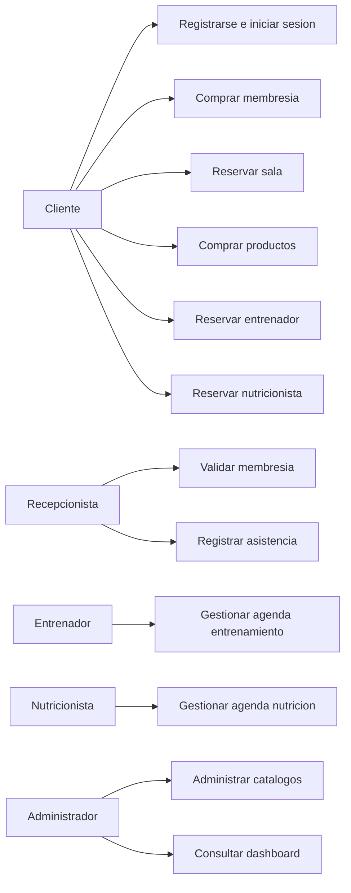

# 05. Casos de Uso

## Diagrama general

## CU-001. Registrarse

- **Actor:** Cliente.
- **Descripcion:** Permite crear una cuenta.
- **Precondiciones:** El correo no debe existir.
- **Flujo principal:** El cliente envia datos, el sistema valida, cifra contrasena, crea usuario con rol Cliente y devuelve confirmacion.
- **Flujo alternativo:** Si el correo existe o faltan datos, devuelve error de validacion.
- **Postcondiciones:** Usuario creado y auditable.

## CU-002. Iniciar sesion

- **Actor:** Usuario.
- **Descripcion:** Permite acceder al sistema.
- **Precondiciones:** Usuario activo y credenciales validas.
- **Flujo principal:** El usuario envia correo y contrasena, el sistema valida bcrypt, emite tokens y devuelve perfil.
- **Flujo alternativo:** Credenciales invalidas o usuario inactivo.
- **Postcondiciones:** Sesion activa.

## CU-003. Comprar membresia

- **Actor:** Cliente.
- **Descripcion:** Activa un plan de membresia.
- **Precondiciones:** Cliente autenticado y plan activo.
- **Flujo principal:** Selecciona plan, confirma metodo de pago simulado, se registra pago, se crea membresia activa.
- **Flujo alternativo:** Metodo rechazado simulado o plan inactivo.
- **Postcondiciones:** Membresia vigente y pago registrado.

## CU-004. Reservar sala

- **Actor:** Cliente.
- **Descripcion:** Reserva cupo en una sala.
- **Precondiciones:** Membresia activa, sala activa, horario disponible.
- **Flujo principal:** Selecciona sala y horario, el sistema valida aforo y duplicidad, crea reserva.
- **Flujo alternativo:** Sin cupo, membresia vencida o reserva duplicada.
- **Postcondiciones:** Reserva confirmada y cupo ocupado.

## CU-005. Cancelar reserva

- **Actor:** Cliente.
- **Descripcion:** Cancela una reserva futura.
- **Precondiciones:** Reserva pertenece al cliente y no inicio.
- **Flujo principal:** Solicita cancelacion, el sistema cambia estado y libera cupo.
- **Flujo alternativo:** Reserva pasada, ya cancelada o ajena.
- **Postcondiciones:** Reserva cancelada.

## CU-006. Comprar productos

- **Actor:** Cliente.
- **Descripcion:** Compra productos de la tienda.
- **Precondiciones:** Productos activos con stock.
- **Flujo principal:** Agrega items, confirma carrito, paga de forma simulada, se descuenta stock y se crea orden.
- **Flujo alternativo:** Stock insuficiente o producto inactivo.
- **Postcondiciones:** Orden confirmada, pago y movimientos de inventario registrados.

## CU-007. Reservar entrenador

- **Actor:** Cliente.
- **Descripcion:** Agenda sesion con entrenador.
- **Precondiciones:** Membresia con beneficio y entrenador disponible.
- **Flujo principal:** Selecciona entrenador y horario, el sistema valida beneficio y agenda, crea cita.
- **Flujo alternativo:** Beneficio no incluido o agenda ocupada.
- **Postcondiciones:** Cita confirmada.

## CU-008. Registrar progreso

- **Actor:** Entrenador.
- **Descripcion:** Registra seguimiento de entrenamiento.
- **Precondiciones:** Cita asociada al entrenador.
- **Flujo principal:** Ingresa observaciones y metricas, el sistema guarda progreso.
- **Flujo alternativo:** Cita inexistente o no autorizada.
- **Postcondiciones:** Progreso visible en historial.

## CU-009. Reservar nutricionista

- **Actor:** Cliente.
- **Descripcion:** Agenda consulta nutricional.
- **Precondiciones:** Membresia Premium o VIP y nutricionista disponible.
- **Flujo principal:** Selecciona profesional y horario, se valida beneficio, se crea cita.
- **Flujo alternativo:** Plan sin beneficio o agenda ocupada.
- **Postcondiciones:** Consulta confirmada.

## CU-010. Administrar catalogos

- **Actor:** Administrador.
- **Descripcion:** Gestiona usuarios, productos, salas, planes, horarios y promociones.
- **Precondiciones:** Usuario autenticado como Administrador.
- **Flujo principal:** El administrador crea, consulta, actualiza o inactiva entidades.
- **Flujo alternativo:** Datos invalidos o entidad relacionada historicamente.
- **Postcondiciones:** Entidad actualizada y accion auditada.

## CU-011. Validar membresia

- **Actor:** Recepcionista.
- **Descripcion:** Verifica si un cliente puede acceder al gimnasio.
- **Precondiciones:** Cliente registrado.
- **Flujo principal:** Busca cliente, revisa membresia activa, registra validacion o asistencia.
- **Flujo alternativo:** Cliente sin membresia vigente.
- **Postcondiciones:** Validacion registrada.

## CU-012. Consultar dashboard

- **Actor:** Administrador.
- **Descripcion:** Visualiza indicadores del negocio.
- **Precondiciones:** Rol Administrador.
- **Flujo principal:** Selecciona rango de fechas, el sistema calcula metricas y devuelve graficos.
- **Flujo alternativo:** Rango invalido o sin datos.
- **Postcondiciones:** Indicadores mostrados.

