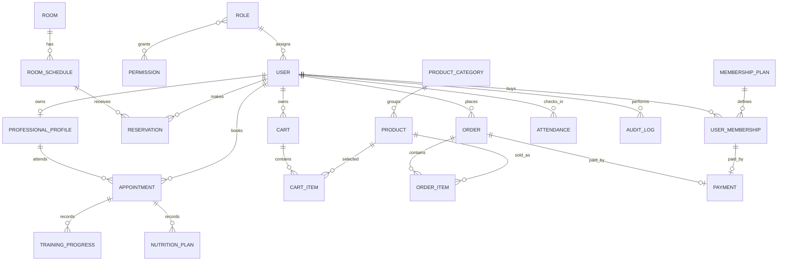

# 07. Modelo Entidad-Relacion

## Diagrama ER

## Tablas propuestas

| Tabla | Clave primaria | Relaciones principales | Restricciones |
| --- | --- | --- | --- |
| roles | id | users, permissions | name unico |
| permissions | id | roles | code unico |
| users | id | roles, memberships, reservations, appointments | email unico |
| membership_plans | id | user_memberships | name unico, price >= 0 |
| user_memberships | id | users, membership_plans, payments | fechas validas, status controlado |
| rooms | id | room_schedules | name unico, capacity > 0 |
| room_schedules | id | rooms, reservations | rango horario valido |
| reservations | id | users, room_schedules | no duplicar usuario/horario activo |
| professional_profiles | id | users, appointments | user_id unico |
| appointments | id | users, professional_profiles | no duplicar profesional/horario activo |
| training_progress | id | appointments | solo citas de entrenamiento |
| nutrition_plans | id | appointments | solo citas nutricionales |
| product_categories | id | products | name unico |
| products | id | product_categories | stock >= 0, price >= 0 |
| carts | id | users | un carrito activo por usuario |
| cart_items | id | carts, products | producto unico por carrito |
| orders | id | users, payments | total >= 0 |
| order_items | id | orders, products | quantity > 0 |
| payments | id | orders o user_memberships | amount >= 0 |
| promotions | id | products o membership_plans | rango de fechas valido |
| attendances | id | users | fecha registrada |
| audit_logs | id | users | accion y entidad requeridas |

## Cardinalidades

- `roles 1:N users`.
- `roles N:M permissions`.
- `users 1:N user_memberships`.
- `membership_plans 1:N user_memberships`.
- `rooms 1:N room_schedules`.
- `room_schedules 1:N reservations`.
- `users 1:N reservations`.
- `users 1:0..1 professional_profiles`.
- `professional_profiles 1:N appointments`.
- `users 1:N appointments` como cliente.
- `orders 1:N order_items`.
- `orders 1:0..1 payments`.

## Optimizacion PostgreSQL

- Indices por `email`, `status`, `created_at`, `starts_at`, `ends_at`.
- Indices compuestos para reservas: `room_schedule_id + status` y `user_id + starts_at`.
- Indices compuestos para citas: `professional_profile_id + starts_at + status`.
- Campos monetarios como `numeric(10,2)`.
- Fechas con `timestamptz` para eventos y `date` para vigencias simples cuando aplique.

