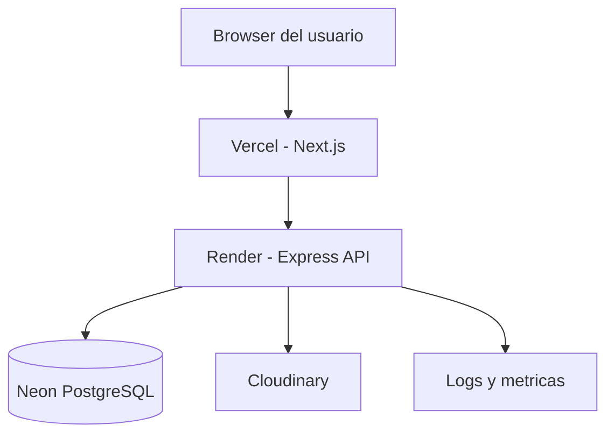
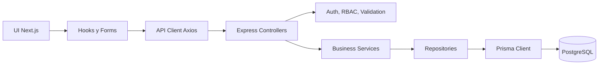
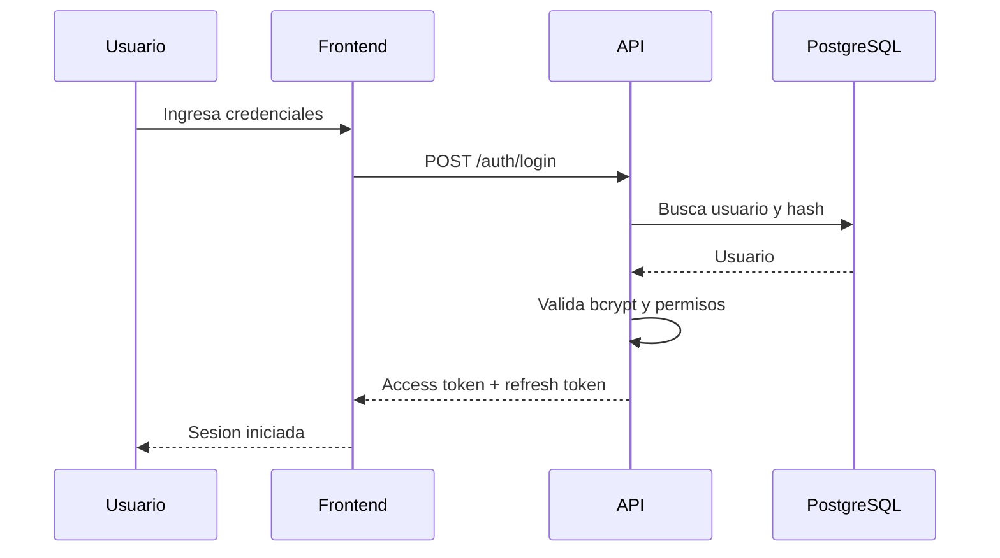
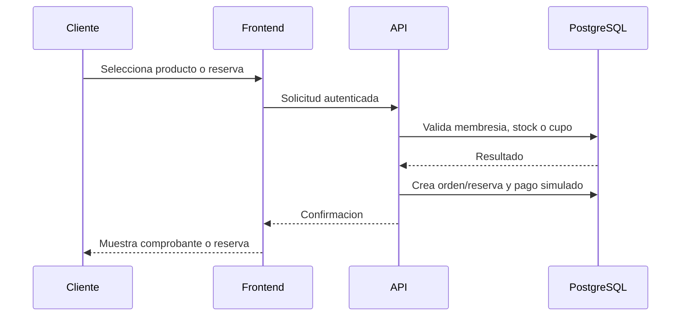

# 09. Arquitectura del Sistema

## Arquitectura fisica

## Arquitectura logica

## Arquitectura por capas

- **Presentacion:** pantallas, componentes, formularios y dashboard en Next.js.
- **Aplicacion:** hooks, servicios frontend, control de estado y manejo de errores.
- **API:** controllers Express, rutas REST y middlewares transversales.
- **Dominio:** services con reglas de negocio y validaciones de flujo.
- **Persistencia:** repositories y Prisma.
- **Infraestructura:** Neon, Cloudinary, Vercel, Render y variables de entorno.

## Flujo de autenticacion

## Flujo de compra y reserva

## Decisiones tecnicas

- Separar frontend y backend permite despliegues independientes y escalabilidad por capa.
- Prisma reduce errores de acceso a datos y facilita migraciones futuras.
- PostgreSQL es adecuado para integridad relacional, transacciones y reportes.
- JWT permite APIs stateless, mientras refresh token controla renovacion de sesiones.
- Cloudinary evita servir imagenes desde el backend.
- OpenAPI y Bruno convierten la API en un contrato verificable desde etapas tempranas.

