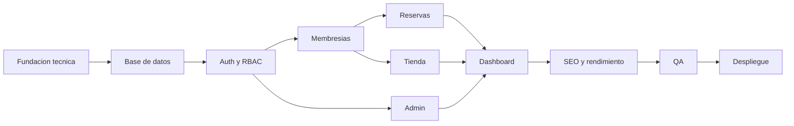

# 16. Roadmap Real de Implementacion

## Objetivo

Definir un plan operativo para construir GymFlow desde la documentacion actual hasta una version demo desplegable. El roadmap esta pensado para un equipo pequeno o una IA trabajando como equipo full stack, con entregables verificables por sprint.

## Estrategia general

- Construir primero la base tecnica, seguridad y modelo de datos.
- Implementar vertical slices completos por modulo: backend, frontend, pruebas API y UI minima.
- Mantener OpenAPI, Bruno y documentacion sincronizados en cada sprint.
- Priorizar flujos demostrables de portafolio: login, membresia, reserva, tienda, checkout y dashboard.
- Dejar pagos reales, facturacion, app movil e integraciones externas fuera de la primera version.

## Definition of Done global

Una funcionalidad se considera terminada cuando cumple:

- Endpoint documentado en OpenAPI.
- Request Bruno creado o actualizado.
- Validaciones de entrada implementadas.
- Reglas de negocio cubiertas en service.
- Autorizacion por rol aplicada.
- UI conectada al backend cuando aplique.
- Estados de loading, error y exito definidos.
- Pruebas unitarias o de integracion para reglas criticas.
- No rompe lint, typecheck ni build.
- README o documento relacionado actualizado si cambia el contrato.

## Fase 0. Preparacion del repositorio documental

**Estado:** completada.

**Entregables existentes:**

- README profesional.
- Requisitos, reglas, historias, casos de uso y trazabilidad.
- Modelo de dominio, ERD y diccionario de datos.
- Arquitectura C4, backend, frontend, seguridad y UI/UX.
- OpenAPI y Bruno.
- SEO, accesibilidad, rendimiento, calidad y despliegue.

**Criterio de salida:**

- Documentacion suficiente para iniciar implementacion sin redisenar el producto.

## Fase 1. Fundacion tecnica del monorepo

**Estado:** completada.

**Objetivo:** crear la base ejecutable del proyecto.

**Duracion sugerida:** 1 sprint.

**Tareas backend:**

- Crear `apps/api` con Express.js, TypeScript y estructura por capas.
- Configurar `app.ts`, `server.ts`, rutas base y health check.
- Configurar manejo centralizado de errores.
- Configurar Helmet, CORS, Morgan y Cookie Parser.
- Configurar variables de entorno validadas.

**Tareas frontend:**

- Crear `apps/web` con Next.js App Router, TypeScript y TailwindCSS.
- Instalar y configurar shadcn/ui.
- Configurar layout base, providers y cliente HTTP.
- Crear rutas publicas iniciales: `/`, `/login`, `/register`.
- Configurar metadata base del proyecto.

**Tareas compartidas:**

- Crear `packages/types` para tipos compartidos si el monorepo lo requiere.
- Configurar ESLint, Prettier, EditorConfig, Husky, lint-staged y commitlint.
- Crear `.env.example` para frontend y backend.
- Crear workflow CI para lint, typecheck y build.

**Entregables:**

- Monorepo funcional.
- Backend responde health check.
- Frontend renderiza landing basica.
- CI ejecuta validaciones.

**Criterios de aceptacion:**

- `apps/api` levanta localmente.
- `apps/web` levanta localmente.
- No hay secretos en el repositorio.
- Lint y typecheck pasan.

## Fase 2. Base de datos, Prisma y seed

**Estado:** completada.

**Objetivo:** implementar el modelo de datos base y datos demo.

**Duracion sugerida:** 1 sprint.

**Tareas:**

- Crear `schema.prisma` basado en ERD y diccionario.
- Modelar roles, usuarios, membresias, salas, horarios, profesionales, productos, ordenes, pagos y auditoria.
- Configurar conexion PostgreSQL Neon.
- Crear primera migracion.
- Implementar seed con roles, usuarios demo, planes, salas, horarios, productos y profesionales.
- Crear script para reset/seed de desarrollo.

**Entregables:**

- Prisma Client generado.
- Migracion inicial.
- Seed reproducible.
- Datos demo para todos los roles.

**Criterios de aceptacion:**

- Base local/remota de desarrollo queda poblada.
- Los usuarios demo existen con roles correctos.
- El modelo soporta las entidades de `docs/06`, `docs/07` y `docs/08`.

## Fase 3. Autenticacion, usuarios y RBAC

**Estado:** completada.

**Objetivo:** permitir acceso seguro por rol.

**Duracion sugerida:** 1 sprint.

**Backend:**

- Implementar registro, login, refresh, logout y forgot password documental/minimo.
- Implementar bcrypt, JWT access token y refresh token revocable.
- Implementar middlewares `authenticate`, `authorizeRole` y `authorizePermission`.
- Implementar perfil actual: `GET/PATCH /users/me`.
- Implementar listado de usuarios y cambio de rol para Administrador.
- Registrar auditoria para cambio de rol y acciones sensibles.

**Frontend:**

- Crear formularios login, registro y recuperacion.
- Crear AuthProvider y manejo de sesion.
- Proteger rutas privadas por rol.
- Crear perfil de usuario.
- Crear vista admin basica de usuarios.

**Pruebas:**

- Login correcto e incorrecto.
- Token ausente/expirado.
- Cliente intentando acceder a endpoint admin.
- Cambio de rol solo por Administrador.

**Entregables:**

- Flujo de sesion completo.
- RBAC operativo.
- Bruno Auth y Users funcionando.

**Criterios de aceptacion:**

- Cliente, admin, recepcionista, entrenador y nutricionista pueden iniciar sesion.
- Rutas privadas bloquean usuarios no autorizados.
- Refresh token revocado no renueva sesion.

## Fase 4. Membresias y pagos simulados

**Estado:** completada.

**Objetivo:** habilitar compra, renovacion y validacion de membresias.

**Duracion sugerida:** 1 sprint.

**Backend:**

- Implementar listado publico de planes.
- Implementar compra de membresia con pago simulado.
- Implementar renovacion de membresia.
- Implementar consulta de membresia actual.
- Implementar validacion de beneficios por plan.
- Crear comprobante interno de pago.

**Frontend:**

- Crear pagina `/planes`.
- Crear cards de planes con beneficios.
- Crear flujo de compra y renovacion.
- Mostrar estado de membresia en dashboard/perfil.

**Pruebas:**

- Compra con metodo Visa, Mastercard, Yape, Plin y Transferencia.
- Renovacion de membresia activa y vencida.
- Usuario sin membresia no puede reservar.

**Entregables:**

- Planes visibles publicamente.
- Cliente puede comprar membresia.
- Pago simulado registrado.

**Criterios de aceptacion:**

- Una compra exitosa crea `UserMembership` activa y `Payment`.
- La membresia activa habilita reservas segun reglas de negocio.

## Fase 5. Salas, horarios y reservas

**Estado:** completada.

**Objetivo:** implementar reservas de salas con control de aforo.

**Duracion sugerida:** 1 sprint.

**Backend:**

- Implementar listado de salas.
- Implementar horarios por sala.
- Implementar creacion de reserva.
- Implementar cancelacion de reserva.
- Validar membresia activa, cupo, sala activa, horario activo y reserva duplicada.
- Usar transacciones para evitar sobrecupo.

**Frontend:**

- Crear pagina `/salas`.
- Crear vista privada `/reservations`.
- Mostrar horarios disponibles y estado de cupos.
- Permitir cancelar reservas futuras.

**Pruebas:**

- Reserva con cupo.
- Reserva sin membresia.
- Reserva duplicada.
- Reserva cuando el cupo esta lleno.
- Cancelacion antes del inicio.

**Entregables:**

- Flujo completo de reserva de sala.
- Bruno Rooms y Reservations funcionando.

**Criterios de aceptacion:**

- No se puede exceder el aforo.
- Una cancelacion libera cupo.
- Un cliente ve solo sus reservas.

## Fase 6. Profesionales, agendas y seguimiento

**Estado:** completada.

**Objetivo:** implementar entrenadores, nutricionistas y citas.

**Duracion sugerida:** 1 sprint.

**Backend:**

- Implementar listado de entrenadores y nutricionistas.
- Implementar reserva de entrenador segun beneficio.
- Implementar reserva de nutricionista solo Premium/VIP.
- Implementar agenda por profesional.
- Implementar registro de progreso de entrenamiento.
- Implementar registro de plan nutricional.

**Frontend:**

- Crear paginas `/entrenadores` y `/nutricionistas`.
- Crear flujo de reserva de cita.
- Crear `/staff/agenda`.
- Crear formularios de progreso y plan nutricional.

**Pruebas:**

- Cliente sin beneficio no reserva entrenador.
- Cliente no Premium/VIP no reserva nutricionista.
- Profesional no puede tener doble cita.
- Profesional ve solo su agenda.

**Entregables:**

- Agendas funcionales.
- Seguimiento basico de cliente.

**Criterios de aceptacion:**

- Las reglas RN-002, RN-003, RN-021, RN-022, RN-023 y RN-024 se cumplen.

## Fase 7. Tienda, carrito, ordenes e inventario

**Estado:** completada.

**Objetivo:** implementar compra de productos con stock controlado.

**Duracion sugerida:** 1 sprint.

**Backend:**

- Implementar categorias y productos.
- Implementar busqueda y paginacion de productos.
- Implementar carrito: ver, agregar, actualizar y eliminar item.
- Implementar checkout con pago simulado.
- Descontar stock transaccionalmente.
- Registrar orden, items y pago.

**Frontend:**

- Crear `/tienda` y `/productos/[slug]`.
- Crear carrito y checkout.
- Mostrar stock, precio y categoria.
- Crear historial `/orders`.

**Pruebas:**

- Agregar producto al carrito.
- Cambiar cantidad.
- Checkout con stock suficiente.
- Checkout con stock insuficiente.
- Historial de ordenes del cliente.

**Entregables:**

- Flujo completo tienda -> carrito -> checkout -> orden.
- Bruno Products, Cart y Orders funcionando.

**Criterios de aceptacion:**

- El stock nunca queda negativo.
- El precio historico queda guardado en `OrderItem`.

## Fase 8. Administracion, promociones y auditoria

**Objetivo:** entregar panel administrativo operativo.

**Duracion sugerida:** 1 sprint.

**Backend:**

- Implementar CRUD admin para usuarios, productos, salas, horarios, planes, promociones y profesionales.
- Implementar inactivacion logica cuando exista historial.
- Implementar auditoria de cambios relevantes.
- Implementar filtros y paginacion en listados admin.

**Frontend:**

- Crear layout `/admin`.
- Crear tablas admin con busqueda, filtros y paginacion.
- Crear formularios para catalogos principales.
- Crear vista de auditoria.

**Pruebas:**

- Cliente no accede a admin.
- Admin crea y actualiza productos.
- Admin inactiva sala/producto con historial.
- Auditoria registra accion.

**Entregables:**

- Panel admin minimo completo.
- Matriz RBAC aplicada.

**Criterios de aceptacion:**

- Los permisos de `docs/21-estandares-arquitectura-calidad.md` se respetan.

## Fase 9. Dashboard y reportes

**Objetivo:** visualizar indicadores del negocio.

**Duracion sugerida:** 1 sprint.

**Backend:**

- Implementar `/dashboard/summary`.
- Calcular ingresos por periodo.
- Calcular membresias activas, vencidas y por vencer.
- Calcular reservas por sala.
- Calcular productos mas vendidos.
- Calcular ticket promedio y clientes nuevos.

**Frontend:**

- Crear dashboard administrador con KPIs.
- Integrar Chart.js con dynamic imports.
- Agregar filtros por rango de fechas.
- Crear estados vacios y de error.

**Pruebas:**

- Dashboard con datos seed.
- Dashboard sin datos.
- Filtros por fecha.
- Acceso solo Administrador.

**Entregables:**

- Dashboard demostrable para portafolio.
- Graficos principales funcionando.

**Criterios de aceptacion:**

- Las metricas de `docs/14-dashboard.md` aparecen en la UI o quedan marcadas como mejora futura.

## Fase 10. SEO, accesibilidad y rendimiento

**Objetivo:** preparar paginas publicas para presentacion profesional.

**Duracion sugerida:** 1 sprint.

**Frontend:**

- Implementar metadata por pagina publica.
- Implementar Open Graph y Twitter Cards.
- Crear `robots.txt`, `sitemap.xml`, manifest y favicons.
- Implementar JSON-LD para Organization, WebSite, BreadcrumbList, Product, Offer y FAQPage.
- Optimizar imagenes con `next/image`.
- Aplicar lazy loading y dynamic imports.
- Revisar contrastes, focus visible, labels y navegacion por teclado.

**Marketing documentado:**

- Preparar puntos de insercion para Google Analytics, Tag Manager, Search Console, Meta Pixel y Clarity.
- Documentar eventos de conversion en codigo o constantes.

**Pruebas:**

- Lighthouse en paginas publicas.
- Validacion manual de teclado.
- Validacion basica con lector de pantalla.
- Rich Results Test para JSON-LD.

**Entregables:**

- Paginas publicas optimizadas.
- SEO tecnico completo.

**Criterios de aceptacion:**

- Lighthouse Performance > 90.
- SEO > 95.
- Accessibility > 95.
- Best Practices > 95.

## Fase 11. QA integral y hardening

**Objetivo:** estabilizar la demo antes de desplegar.

**Duracion sugerida:** 1 sprint.

**Tareas:**

- Ejecutar suite de pruebas unitarias e integracion.
- Ejecutar coleccion Bruno completa.
- Revisar OWASP Top 10 documentado.
- Revisar logs sin secretos.
- Revisar CORS, Helmet y errores HTTP.
- Revisar transacciones de stock y reservas.
- Revisar estados responsive.
- Actualizar documentacion si hubo cambios.

**Entregables:**

- Release candidate.
- Checklist de despliegue completado.
- Reporte de pruebas.

**Criterios de aceptacion:**

- No hay errores criticos abiertos.
- Los flujos principales funcionan end to end.
- Build frontend y backend pasan.

## Fase 12. Despliegue y presentacion final

**Objetivo:** publicar una demo profesional de portafolio.

**Duracion sugerida:** 1 sprint corto.

**Tareas:**

- Crear base Neon de produccion/demo.
- Configurar Render para backend.
- Configurar Vercel para frontend.
- Configurar variables de entorno.
- Ejecutar migraciones y seed demo.
- Verificar CORS entre Vercel y Render.
- Ejecutar smoke test con Bruno contra produccion.
- Preparar README final con URLs de demo.
- Preparar checklist de presentacion.

**Entregables:**

- Frontend desplegado.
- Backend desplegado.
- Base demo poblada.
- Documentacion final actualizada.

**Criterios de aceptacion:**

- Usuario evaluador puede entrar, comprar membresia simulada, reservar sala, comprar producto y ver dashboard admin con usuarios demo.

## Backlog priorizado

| Prioridad | Alcance |
| --- | --- |
| P0 | Monorepo, base de datos, auth, RBAC, membresias, pagos simulados, reservas de salas. |
| P1 | Tienda, carrito, ordenes, inventario, admin minimo y dashboard basico. |
| P2 | Entrenadores, nutricionistas, progreso, planes nutricionales, auditoria y promociones. |
| P3 | Blog, reportes exportables, analytics real, tema dark, mejoras PWA y observabilidad avanzada. |

## Ruta critica

## Sprints sugeridos

| Sprint | Objetivo | Entregable demostrable |
| --- | --- | --- |
| Sprint 1 | Fundacion tecnica | Monorepo con web, API, CI y health check. |
| Sprint 2 | Base de datos | Prisma, migracion y seed demo. |
| Sprint 3 | Auth y usuarios | Login por roles, perfil y admin usuarios. |
| Sprint 4 | Membresias | Compra/renovacion con pago simulado. |
| Sprint 5 | Salas y reservas | Cliente reserva y cancela sala con aforo controlado. |
| Sprint 6 | Profesionales | Cliente agenda entrenador/nutricionista segun membresia. |
| Sprint 7 | Tienda | Productos, carrito, checkout e inventario. |
| Sprint 8 | Admin y auditoria | CRUDs principales y auditoria. |
| Sprint 9 | Dashboard | KPIs y graficos con datos reales. |
| Sprint 10 | SEO y accesibilidad | Paginas publicas optimizadas. |
| Sprint 11 | QA y hardening | Flujos end to end estables. |
| Sprint 12 | Deploy | Demo publica en Vercel + Render + Neon. |

## Versiones de entrega

| Version | Contenido | Objetivo |
| --- | --- | --- |
| v0.1 | Monorepo, DB, auth, RBAC | Base tecnica. |
| v0.2 | Membresias y pagos simulados | Primer flujo comercial. |
| v0.3 | Reservas de salas | Primer flujo operativo. |
| v0.4 | Profesionales | Servicios de valor agregado. |
| v0.5 | Tienda y checkout | Segundo flujo comercial. |
| v0.6 | Admin y dashboard | Producto administrable. |
| v1.0 | SEO, QA y despliegue | Demo final de portafolio. |

## Riesgos y mitigaciones

| Riesgo | Mitigacion |
| --- | --- |
| Modelo de datos demasiado grande | Implementar por vertical slices y migraciones incrementales. |
| Reglas de reservas con condiciones de carrera | Usar transacciones e indices unicos/consultas bloqueantes donde aplique. |
| RBAC inconsistente | Usar matriz de permisos como fuente de verdad y pruebas 403. |
| Dashboard lento | Agregar indices, selects especificos y agregaciones controladas. |
| Frontend pesado | Dynamic imports para charts y componentes admin. |
| SEO olvidado al final | Implementar metadata desde la fundacion del frontend. |
| Demo dificil de evaluar | Mantener seed demo con usuarios y datos listos. |

## Orden recomendado para empezar a programar

1. Crear monorepo y tooling.
2. Implementar backend health check y estructura por capas.
3. Implementar frontend base y layout publico.
4. Crear Prisma schema y seed.
5. Implementar auth y RBAC.
6. Construir vertical slices siguiendo el orden de sprints.
