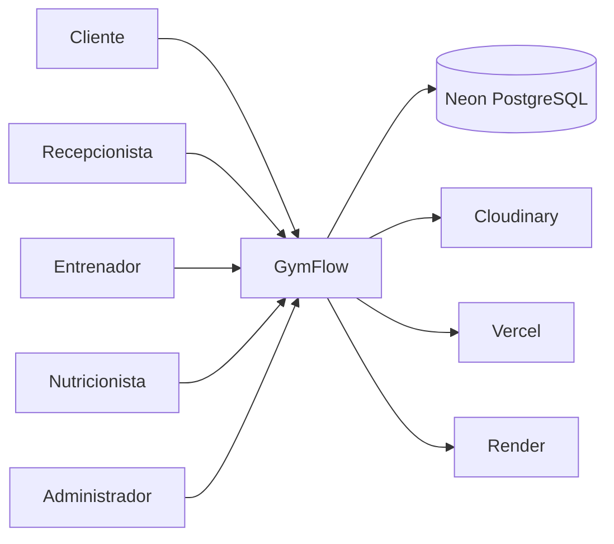
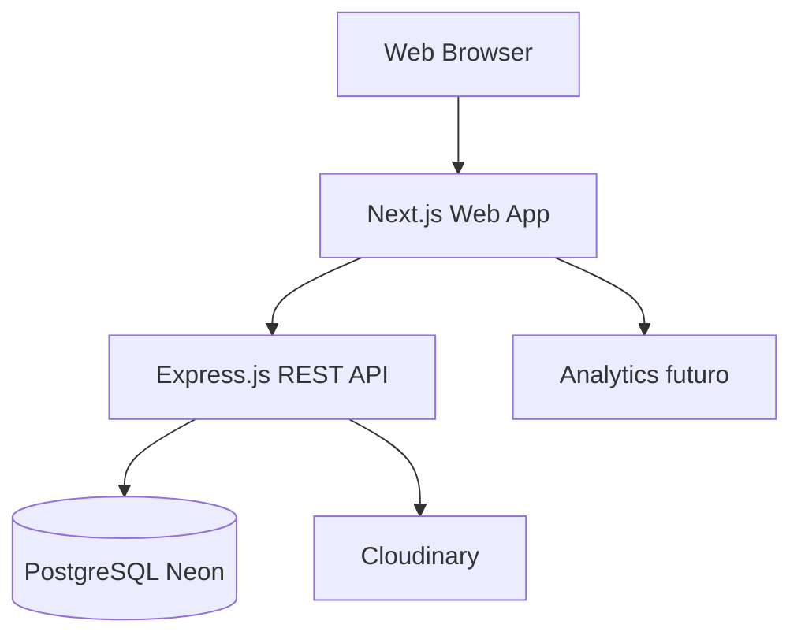
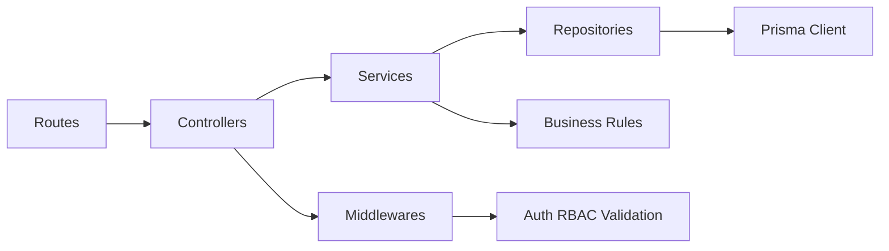
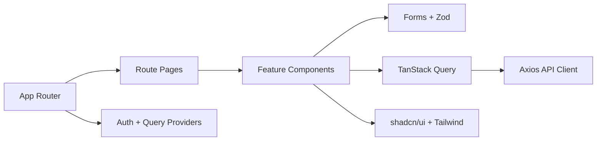
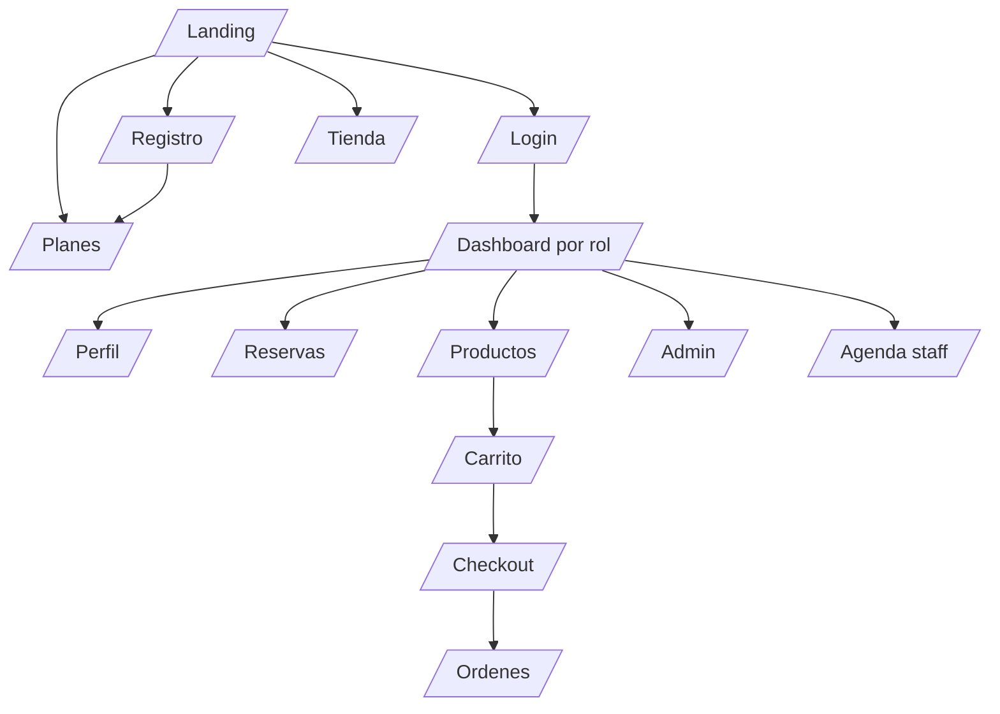

# 21. Estandares de Arquitectura y Calidad

## Objetivo

Complementar la documentacion de GymFlow con criterios de arquitectura empresarial, permisos, navegacion, design system, convenciones, Git Flow, calidad de codigo, seguridad, logs, cache y revisiones previas a despliegue y presentacion.

## Arquitectura C4

### Nivel 1. Context Diagram



### Nivel 2. Container Diagram



### Nivel 3. Component Diagram Backend



### Nivel 3. Component Diagram Frontend



## Modelo RBAC

| Modulo | Administrador | Recepcionista | Cliente | Entrenador | Nutricionista |
| --- | --- | --- | --- | --- | --- |
| Usuarios | CRUD | R operativo | Perfil propio | Perfil propio | Perfil propio |
| Roles y permisos | CRUD | - | - | - | - |
| Membresias | CRUD planes, R global | Validar, registrar pago | Comprar, renovar, R propia | R beneficios cliente asignado | R beneficios cliente asignado |
| Salas | CRUD | R, gestionar reservas | R, reservar propias | R agenda relacionada | R agenda relacionada |
| Reservas | CRUD | CRUD operativo | CRUD propias | R agenda | R agenda |
| Entrenadores | CRUD | R | R, reservar | R/U propio | R |
| Nutricionistas | CRUD | R | R, reservar | R | R/U propio |
| Productos | CRUD | R | R, comprar | R | R |
| Carrito | - | - | CRUD propio | - | - |
| Ordenes | R global | R operativo | R propias | - | - |
| Pagos | R global | Crear/R presencial | R propios | - | - |
| Dashboard | R completo | R operativo limitado | - | Agenda propia | Agenda propia |
| Auditoria | R | - | - | - | - |

## Matriz CRUD por entidad

| Entidad | Create | Read | Update | Delete/Inactivar |
| --- | --- | --- | --- | --- |
| User | Admin, Registro publico | Admin, propio | Admin, propio | Admin |
| Role | Admin | Admin | Admin | Admin |
| Permission | Admin | Admin | Admin | Admin |
| MembershipPlan | Admin | Publico | Admin | Admin |
| UserMembership | Cliente/Admin | Admin, propio, recepcionista | Admin | Admin |
| Room | Admin | Usuario | Admin | Admin |
| RoomSchedule | Admin | Usuario | Admin | Admin |
| Reservation | Cliente, recepcionista, admin | Propio, staff, admin | Propio limitado, staff, admin | Cancelar/Inactivar |
| ProfessionalProfile | Admin | Usuario | Admin, profesional propio | Admin |
| Appointment | Cliente/Admin | Propio, profesional, admin | Profesional/Admin | Cancelar/Inactivar |
| ProductCategory | Admin | Publico | Admin | Admin |
| Product | Admin | Publico | Admin | Admin |
| Cart | Cliente | Cliente | Cliente | Cliente |
| CartItem | Cliente | Cliente | Cliente | Cliente |
| Order | Cliente | Cliente, admin | Admin limitado | No borrar; inactivar/anular |
| OrderItem | Sistema | Cliente, admin | No aplica | No aplica |
| Payment | Sistema, recepcionista | Propio, admin, recepcionista | Admin limitado | No borrar; anular |
| Promotion | Admin | Publico/Admin | Admin | Admin |
| Attendance | Recepcionista/Admin | Admin, recepcionista | Admin | Admin |
| AuditLog | Sistema | Admin | No aplica | No aplica |

## Modelo de navegacion



## Sitemap funcional

```text
/
/nosotros
/planes
/salas
/entrenadores
/nutricionistas
/tienda
/productos/[slug]
/blog
/blog/[slug]
/contacto
/login
/register
/forgot-password
/dashboard
/profile
/reservations
/cart
/checkout
/orders
/admin
/admin/users
/admin/products
/admin/rooms
/admin/memberships
/admin/reports
/staff/agenda
```

## Design system

| Elemento | Estandar |
| --- | --- |
| Colores | Paleta con primario fitness, neutros accesibles y estados semanticos. |
| Tipografia | Sans para interfaz, mono solo para datos tecnicos. |
| Botones | Variantes primary, secondary, outline, ghost, destructive. |
| Inputs | Label visible, helper text y error asociado. |
| Cards | Radio maximo 8 px salvo componentes del sistema. |
| Modales | Titulo, descripcion, foco inicial y cierre accesible. |
| Espaciado | Escala 4/8/12/16/24/32/48/64. |
| Sombras | Sutiles, evitar decoracion pesada. |
| Iconografia | Lucide Icons. |
| Tema | Light por defecto; dark preparado como mejora futura. |

## Convenciones

| Categoria | Convencion |
| --- | --- |
| Carpetas | kebab-case. |
| Componentes React | PascalCase. |
| Hooks | camelCase con prefijo `use`. |
| Funciones/variables TS | camelCase. |
| Tipos/interfaces | PascalCase. |
| Constantes globales | UPPER_SNAKE_CASE. |
| Base de datos | snake_case para tablas y columnas. |
| Rutas URL | kebab-case. |
| IDs documentales | RF-001, RNF-001, RN-001, HU-001, CU-001. |
| Ramas Git | `feature/auth`, `fix/reservations-capacity`, `release/v1`. |
| Commits | Conventional Commits: `feat:`, `fix:`, `docs:`, `test:`, `refactor:`. |

## Git Flow

```text
main
develop
feature/*
fix/*
release/*
hotfix/*
```

- `main`: estado estable y desplegable.
- `develop`: integracion de features.
- `feature/*`: nuevas funcionalidades.
- `fix/*`: correcciones no urgentes.
- `release/*`: estabilizacion previa a entrega.
- `hotfix/*`: correcciones criticas desde produccion.

## Estructura del monorepo futura

```text
gymflow/
  apps/
    web/
    api/
  packages/
    shared/
    types/
    config/
  docs/
  openapi/
  bruno/
  scripts/
  .github/
```

## Configuracion del proyecto

| Herramienta | Uso |
| --- | --- |
| ESLint | Reglas de calidad TypeScript, React, imports y accesibilidad. |
| Prettier | Formato automatico consistente. |
| EditorConfig | Convenciones de editor. |
| Husky | Git hooks locales. |
| lint-staged | Lint/format solo en archivos modificados. |
| commitlint | Validar Conventional Commits. |
| TypeScript strict | Reducir errores de tipos. |

## Principios de arquitectura y codigo

- SOLID para servicios, dependencias y separacion de responsabilidades.
- DRY sin crear abstracciones prematuras.
- KISS para mantener flujos comprensibles.
- Clean Code con nombres claros, funciones pequenas y errores explicitos.
- Controllers delgados y services con reglas de negocio.
- Validacion en bordes de entrada.
- Repositories sin logica de negocio.

## Manejo de errores

- Errores normalizados con `code`, `message` y `details`.
- Diferenciar errores de validacion, autenticacion, autorizacion, negocio y sistema.
- No exponer stack traces al cliente.
- Registrar errores con contexto tecnico suficiente.
- Mapear reglas de negocio a `409` o `422` segun corresponda.

## Estrategia de logs

- Logs de request con metodo, ruta, status y duracion.
- Logs de errores con request id.
- No registrar contrasenas, tokens, secretos ni datos sensibles.
- Auditoria para cambios de roles, pagos, membresias, stock, reservas y configuracion.
- Preparar integracion futura con proveedor de observabilidad.

## Seguridad OWASP Top 10

| Riesgo | Mitigacion prevista |
| --- | --- |
| Broken Access Control | RBAC, permisos por endpoint y pruebas 403. |
| Cryptographic Failures | bcrypt, HTTPS, secretos en env vars. |
| Injection | Prisma parametrizado y validacion estricta. |
| Insecure Design | Reglas de negocio documentadas y revisadas. |
| Security Misconfiguration | Helmet, CORS restringido, no stack traces. |
| Vulnerable Components | Auditoria de dependencias. |
| Identification/Auth Failures | JWT corto, refresh revocable, rate limit. |
| Software/Data Integrity | CI, lockfiles, revisiones de PR. |
| Logging/Monitoring Failures | Logs y auditoria de eventos sensibles. |
| SSRF | Validar URLs externas y restringir cargas remotas. |

## Optimizacion de consultas

- Paginacion obligatoria en listados.
- Indices en campos de busqueda, fechas y estados.
- Evitar N+1 con includes/selects controlados.
- Seleccionar solo campos necesarios.
- Usar transacciones para stock, cupos y pagos.
- Medir consultas lentas en endpoints de dashboard.

## Estrategia de cache documentada

- Cache publico para contenido marketing y catalogos no sensibles.
- Invalidacion por tags futura para productos, planes y salas.
- No cachear respuestas privadas de perfil, ordenes, pagos ni dashboard por usuario.
- Usar CDN para imagenes.
- Definir `Cache-Control` por tipo de endpoint.

## Checklist previo al despliegue

- Variables de entorno configuradas.
- OpenAPI actualizado.
- Bruno ejecuta flujo principal.
- Migraciones aplicadas.
- Seed demo disponible.
- Lighthouse en objetivos.
- CORS restringido.
- Dependencias auditadas.
- Logs sin secretos.
- Rutas privadas protegidas.
- Backups Neon habilitados.

## Checklist para presentacion final

- README permite entender el proyecto rapidamente.
- Diagramas Mermaid renderizan.
- C4, ERD y arquitectura explican el sistema.
- RBAC y matriz CRUD estan completos.
- OpenAPI abre correctamente.
- Bruno contiene flujo demostrable.
- Roadmap muestra criterio de priorizacion.
- SEO, accesibilidad y rendimiento estan documentados.
- Limitaciones declaradas: pagos simulados y sin implementacion de codigo en esta fase.

